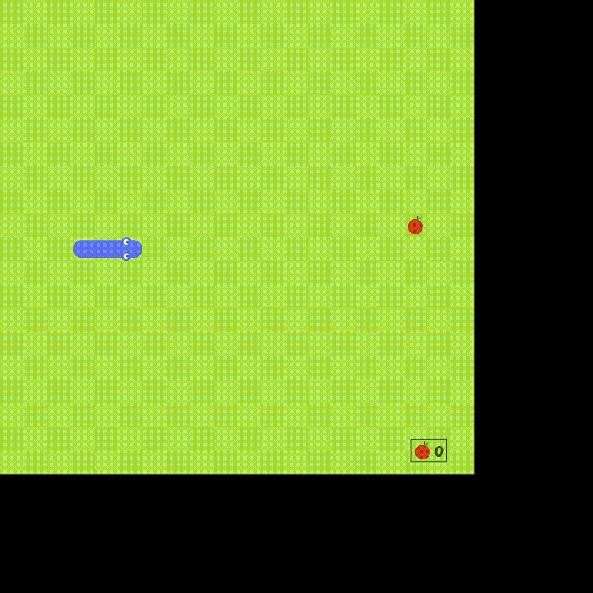

# Snake Game

A classic Snake Game implemented in Python using the Pygame library.

## Overview

This Snake Game project is a nostalgic and fun implementation of the classic Snake game. Players control a snake that grows longer as it eats apples while avoiding collisions with the walls and itself. The game offers colorful graphics, animations, sound effects, and score tracking.

## Features

- Classic Snake gameplay.
- Colorful graphics and animations.
- Sound effects for eating apples.
- Score tracking.
- Responsive keyboard controls.

## Demo

## How to Play
- Run the game
- Use the arrow keys (Up, Down, Left, Right) to control the snake's direction.
- Eat apples to grow longer and increase your score.
- Avoid colliding with the walls or the snake itself.

## Controls
- Up Arrow: Move the snake up.
- Down Arrow: Move the snake down.
- Left Arrow: Move the snake left.
- Right Arrow: Move the snake right.
